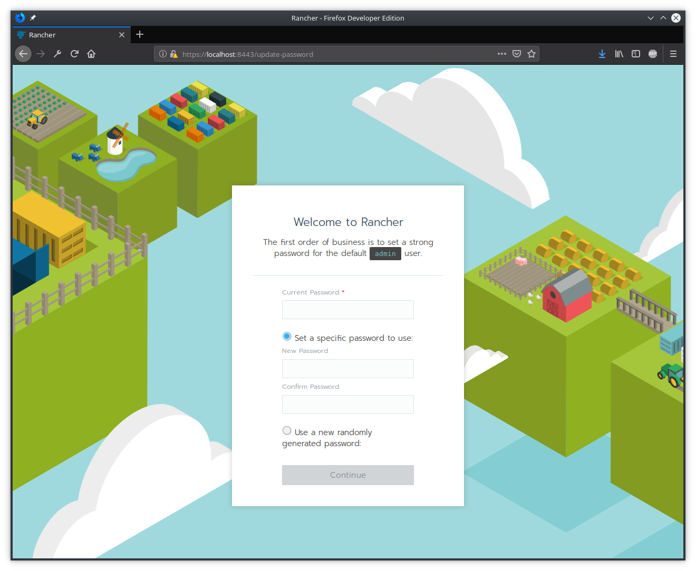

# Rancher 2.0 on Alpine Linux

## Setup

In this directory the Vagrantfile is setup, simply issue:

```
$ vagrant up
```

The Vagrant Script includes everything needed for setting up docker.

```
Vagrant.configure("2") do |config|
  config.vm.box = "generic/alpine37"
  config.vm.network "forwarded_port", guest: 8443, host: 8443
  #config.vm.network "public_network"
  config.vm.provider "virtualbox" do |vb|
    vb.name = "wigo4it-rancher2"
    vb.cpus = 4
    vb.memory = "4096"
  end
  config.vm.provision "shell", inline: $script
end

$script = <<-SCRIPT
sudo apk add docker
sudo apk add openrc --no-cache
sudo rc-update add docker boot
sudo service docker start
sleep 10
sudo docker run --name=rancher -d --restart=unless-stopped -p 8085:80 -p 8443:443 -v /var/lib/rancher:/var/lib/rancher rancher/rancher:v2.0.6
SCRIPT
```

Output:

```
Bringing machine 'default' up with 'virtualbox' provider...
==> default: Importing base box 'generic/alpine37'...
==> default: Matching MAC address for NAT networking...
==> default: Checking if box 'generic/alpine37' is up to date...
==> default: Setting the name of the VM: wigo4it-rancher2
==> default: Fixed port collision for 22 => 2222. Now on port 2200.
==> default: Clearing any previously set network interfaces...
==> default: Preparing network interfaces based on configuration...
    default: Adapter 1: nat
==> default: Forwarding ports...
    default: 8443 (guest) => 8443 (host) (adapter 1)
    default: 22 (guest) => 2200 (host) (adapter 1)
==> default: Running 'pre-boot' VM customizations...
==> default: Booting VM...
==> default: Waiting for machine to boot. This may take a few minutes...
    default: SSH address: 127.0.0.1:2200
    default: SSH username: vagrant
    default: SSH auth method: private key
    default:
    default: Vagrant insecure key detected. Vagrant will automatically replace
    default: this with a newly generated keypair for better security.
    default:
    default: Inserting generated public key within guest...
    default: Removing insecure key from the guest if it's present...
    default: Key inserted! Disconnecting and reconnecting using new SSH key...
==> default: Machine booted and ready!
==> default: Running provisioner: shell...
    default: Running: inline script
    default: fetch https://dl-4.alpinelinux.org/alpine/v3.7/main/x86_64/APKINDEX.tar.gz
    default: fetch https://dl-4.alpinelinux.org/alpine/v3.7/community/x86_64/APKINDEX.tar.gz
    default: fetch http://nl.alpinelinux.org/alpine/edge/testing/x86_64/APKINDEX.tar.gz
    default: fetch http://nl.alpinelinux.org/alpine/edge/main/x86_64/APKINDEX.tar.gz
    default: (1/7) Installing libmnl (1.0.4-r0)
    default: (2/7) Installing jansson (2.10-r0)
    default: (3/7) Installing libnftnl-libs (1.0.8-r1)
    default: (4/7) Installing iptables (1.6.1-r1)
    default: (5/7) Installing libltdl (2.4.6-r4)
    default: (6/7) Installing libseccomp (2.3.2-r1)
    default: (7/7) Installing docker (17.12.1-r0)
    default: Executing docker-17.12.1-r0.pre-install
    default: Executing busybox-1.27.2-r11.trigger
    default: OK: 308 MiB in 80 packages
    default: fetch https://dl-4.alpinelinux.org/alpine/v3.7/main/x86_64/APKINDEX.tar.gz
    default: fetch https://dl-4.alpinelinux.org/alpine/v3.7/community/x86_64/APKINDEX.tar.gz
    default: fetch http://nl.alpinelinux.org/alpine/edge/testing/x86_64/APKINDEX.tar.gz
    default: fetch http://nl.alpinelinux.org/alpine/edge/main/x86_64/APKINDEX.tar.gz
    default: OK: 308 MiB in 80 packages
    default:  * service docker added to runlevel boot
    default:  * Caching service dependencies ... [ ok ]
    default:  * /var/log/docker.log: creating file
    default:  * /var/log/docker.log: correcting mode
    default:  * /var/log/docker.log: correcting owner
    default:  * Starting docker ...
    default:  [ ok ]
    default: Unable to find image 'rancher/rancher:v2.0.6' locally
    default: v2.0.6: Pulling from rancher/rancher
    default: 6b98dfc16071: Pulling fs layer
    default: 4001a1209541: Pulling fs layer
    default: 6319fc68c576: Pulling fs layer
    default: b24603670dc3: Pulling fs layer
    default: 97f170c87c6f: Pulling fs layer
    default: c5880aba2145: Pulling fs layer
    default: de3fa5ee4e0d: Pulling fs layer
    default: c973e0300d3b: Pulling fs layer
    default: d0f63a28838b: Pulling fs layer
    default: b5f0c036e778: Pulling fs layer
    default: b24603670dc3:
    default: Waiting
    default: c973e0300d3b: Waiting
    default: d0f63a28838b: Waiting
    default: b5f0c036e778: Waiting
    default: c5880aba2145: Waiting
    default: 97f170c87c6f: Waiting
    default: de3fa5ee4e0d: Waiting
    default: 6319fc68c576: Verifying Checksum
    default: 6319fc68c576: Download complete
    default: 4001a1209541: Verifying Checksum
    default: 4001a1209541: Download complete
    default: b24603670dc3: Download complete
    default: 97f170c87c6f: Verifying Checksum
    default: 97f170c87c6f: Download complete
    default: de3fa5ee4e0d: Verifying Checksum
    default: de3fa5ee4e0d: Download complete
    default: 6b98dfc16071: Download complete
    default: c973e0300d3b: Verifying Checksum
    default: c973e0300d3b: Download complete
    default: 6b98dfc16071: Pull complete
    default: 4001a1209541: Pull complete
    default: 6319fc68c576: Pull complete
    default: b24603670dc3: Pull complete
    default: 97f170c87c6f: Pull complete
    default: d0f63a28838b: Download complete
    default: b5f0c036e778: Verifying Checksum
    default: b5f0c036e778: Download complete
    default: c5880aba2145: Verifying Checksum
    default: c5880aba2145: Download complete
    default: c5880aba2145: Pull complete
    default: de3fa5ee4e0d: Pull complete
    default: c973e0300d3b: Pull complete
    default: d0f63a28838b: Pull complete
    default: b5f0c036e778: Pull complete
    default: Digest: sha256:3f042503cda9c9de63f9851748810012de01de380d0eca5f1f296d9b63ba7cd5
    default: Status: Downloaded newer image for rancher/rancher:v2.0.6
    default: 6e84baa5270d53538e22f1de8ebe3ebb626864069498cb0143ae9b97d8826fce
```

You can now setup Rancher 2.0 from the web browser on https://localhost:8443



