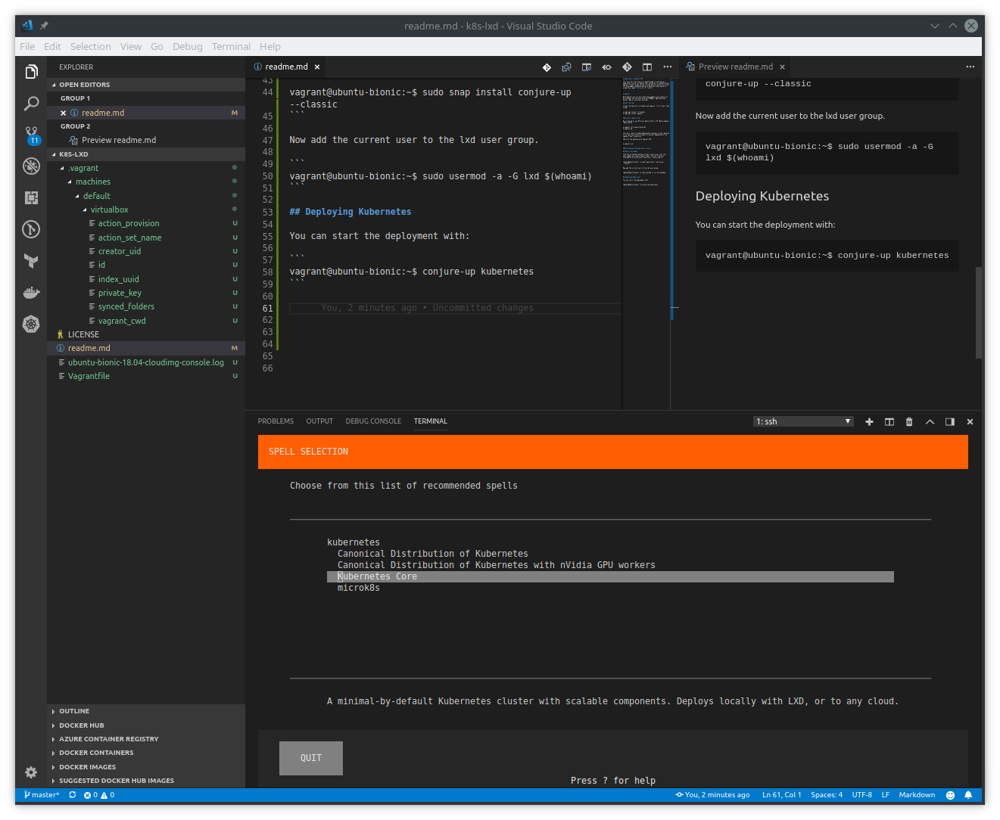
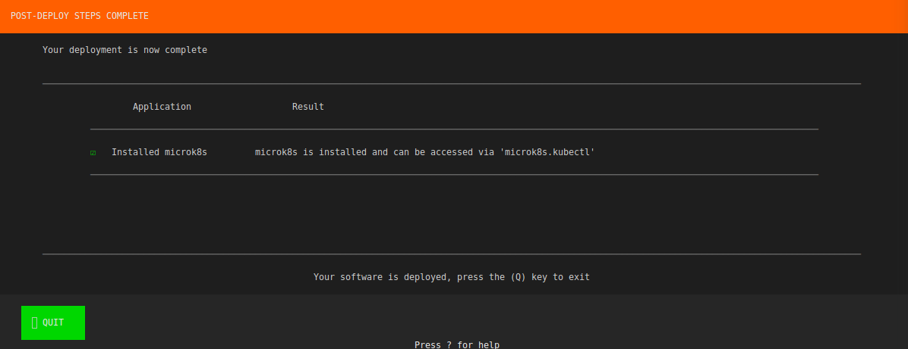

# Kubernetes on Ubuntu LXD

This tutorial functions as a walkthrough in setting up a kubernetes cluster on Ubuntu LXD running on virtualbox using Vagrant to get things up and running quickly and effortlessly for development purposes and as a possible step towards a production ready **on premise** cluster.

# Vagrant

With Vagrant you can distribute development environments on Virtualbox, but can also work with VMWare, Openstack and Docker, AWS or any other provider. 

## Get started

To get started with virtualbox and vagrant, first intall them using:

```
$ sudo apt install virtualbox
$ sudo apt install vagrant
```

### Install Ubuntu LXD

We are going to use Official Ubuntu 18.0.4 LTS (Bionic Beaver) Daily build.

```
$ vagrant init ubuntu/bionic64
$ vagrant up
```

This will result in downloading and running a virtual machine in virtual box within a couple of minutes depending on the speed of your connection.

SSH into the machine with vagrant SSH.

```
$ vagrant ssh
```

Setup LXD

```
vagrant@ubuntu-bionic:~$ sudo apt-get install lxd
vagrant@ubuntu-bionic:~$ sudo lxd init

```

### Setting up the Kubernetes cluster

## Before you begin

From the Virtualbox machine install conjure-up. This lets your symmon up a big software stack. You can find more information on conjure-up from https://conjure-up.io

```
vagrant@ubuntu-bionic:~$ sudo snap install conjure-up --classic
```

Now add the current user to the lxd user group.

```
vagrant@ubuntu-bionic:~$ sudo usermod -a -G lxd $(whoami)
```

## Deploying Kubernetes

You can start the deployment with:

```
vagrant@ubuntu-bionic:~$ conjure-up kubernetes
```

1. You can now cast a "spell", we are going to setup a MicroK8s, a small single node kubernetes cluster. In a later exercise we will do a minimal kubernetes core distribution, for now lets keep things simple. (the first screenshot shows execution from bash in visual studio)




2. Enter your sudo password as indicated. (the vagrant distribution does not require a password)

3. After a minute or so the microK8s cluster is installed and deployed. Press Q to exit



Microk8s is installed and can be accessed via 'microk8s.kubectl'. To use kubectl please install it.

```
vagrant@ubuntu-bionic:~$ sudo snap install kubectl --classic
```

You can now list the nodes and services.

```
vagrant@ubuntu-bionic:~$ kubectl get services
NAME         TYPE        CLUSTER-IP     EXTERNAL-IP   PORT(S)   AGE
kubernetes   ClusterIP   10.152.183.1   <none>        443/TCP   6m23s

vagrant@ubuntu-bionic:~$ microk8s.kubectl get nodes
NAME            STATUS   ROLES    AGE     VERSION
ubuntu-bionic   Ready    <none>   7m45s   v1.12.0
```

You now have a single node kubernetes cluster up and running.