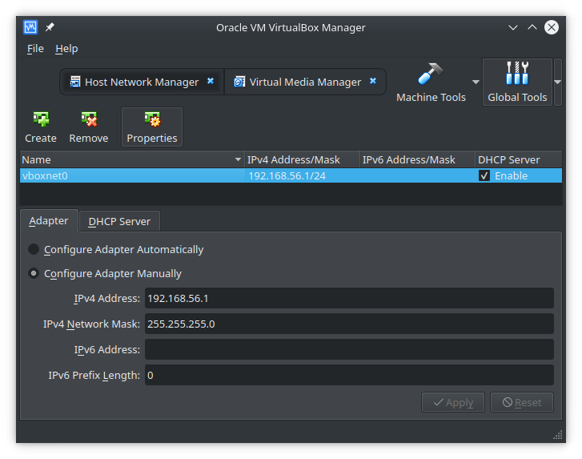
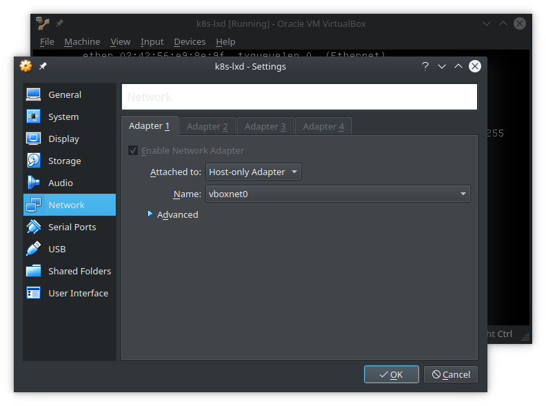

# Continous integration and deployment

For the CI/CD pipeline the fieldlab uses gitlab. We will install a selfhosted lab on kubernetes. This site describes how the environment is setup. The main tools that are used for installation are:

* Vagrant
* Kubectl (kubernetes)
* HELM (charts)

## Setup the K8S cluster

This is described in the following section: [k8s-cluster]()

## Install Helm

To install the cluster make sure you have HELM installed. We will be using HELM as our packagemanager for Kubernetes. You can install Helm using snap. Tested on KDE (Kubuntu 18.04)

For more information on HELM, Get started with the [Quick Start guide](https://docs.helm.sh/using_helm/#quickstart-guide) or plunge into the [complete documentation](https://docs.helm.sh/)

```
$ sudo snap install helm
```
This wil install helm client latest version. If you get an error such as below, during further operation with helm while setting up your postgresql cluster:

```
incompatible versions client[v2.11.0] server[v2.10.0]
```

Then upgrade the helm server version (Tiller) to the latest version and reinitialize for a ready tiller pod as follows:

```
$ helm init --upgrade
$HELM_HOME has been configured at /home/**********/.helm.
Tiller (the Helm server-side component) has been upgraded to the current version.
Happy Helming!

$ helm init
```

## Deploying Gitlab

### Helm Chart

After setting up the K8S cluster we are ready to deploy gitlab using the provided helm chart.

This chart contains all the required components to get started, and can scale to large deployments. It offers a number of benefits:

* Horizontal scaling of individual components
* No requirement for shared storage to scale
* Containers do not need root permissions
* Automatic SSL with Let's Encrypt
* An unprivileged GitLab Runner
* and plenty more.

For more information please visit [Gitlab Helm Chart](https://docs.gitlab.com/ee/install/kubernetes/gitlab_chart.html) 

### Deploy to Kubernetes

A Kubernetes cluster, version 1.8 or higher. 6vCPU and 16GB of RAM is recommended.

SSH into your, previously setup vagrant deployed virtualbox. Note that we have renamed the virtual box to *k8s-lxd*.

To make things easier in our network topology, we create a vboxnet0 in OracleVM Virtualbox manager.



Now set your vagrant deployment adapter settings to use vboxnet0.



Check network connectivity from your local machine running virtualbox.

```bash
$ ping 192.168.56.101
PING 192.168.56.101 (192.168.56.101) 56(84) bytes of data.
64 bytes from 192.168.56.101: icmp_seq=1 ttl=64 time=0.613 ms

```
Now set the context of the cluster so you can access it.

```
$ kubectl config set-cluster k8s-lxd-cluster --server=http://192.168.56.101:8080
Cluster "k8s-lxd-cluster" set.

$ kubectl config set-context k8s-lxd --cluster=k8s-lxd-cluster
Context "k8s-lxd" created.

$ kubectl config use-context k8s-lxd
Switched to context "k8s-lxd".

$ kubectl get nodes
NAME            STATUS   ROLES    AGE   VERSION
ubuntu-bionic   Ready    <none>   18h   v1.12.0
```

You can now install gitlab using helm.

```
$ helm init
$ helm upgrade --install gitlab gitlab/gitlab \
    --timeout 600 \
    --set global.hosts.domain=example.com \
    --set global.hosts.externalIP=192.168.56.101 \
    --set certmanager-issuer.email=email@example.com
```
